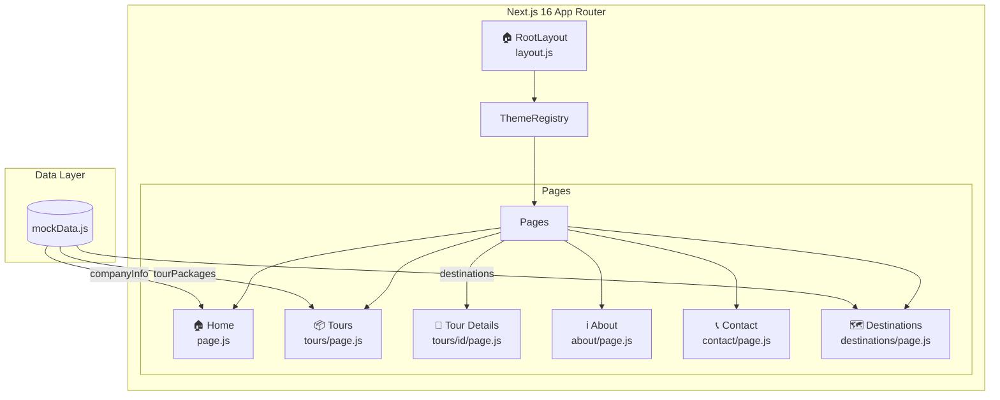
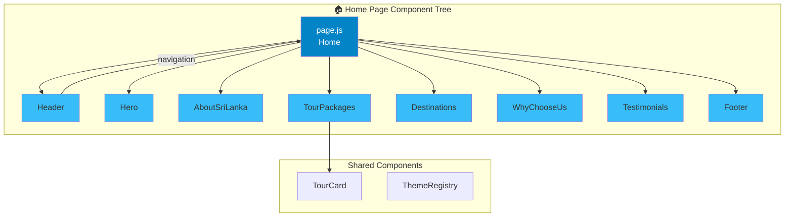
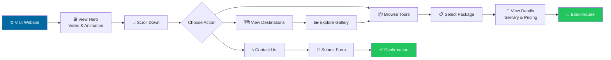
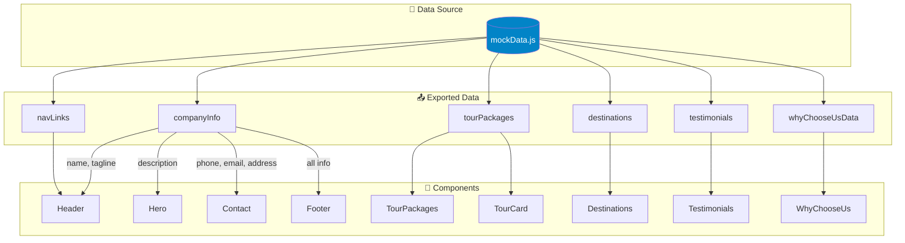
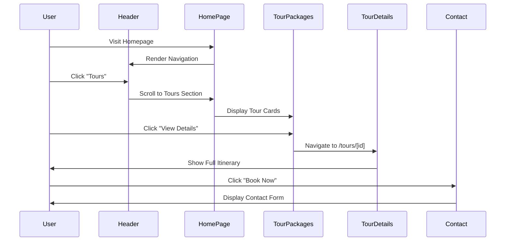
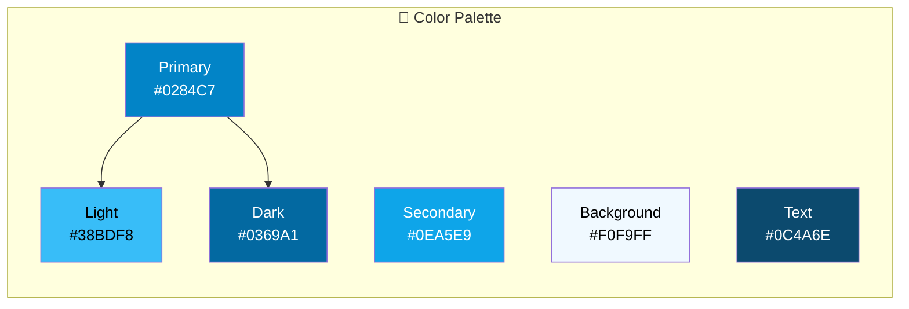
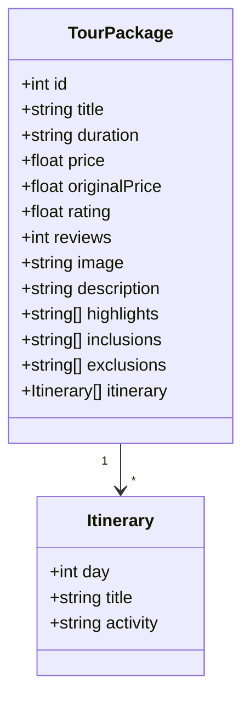

<p align="center">
  
  
  
  
</p>

<h1 align="center">🌴 Ceylon Escapes</h1>
<h3 align="center">Discover the Pearl of the Indian Ocean</h3>

<p align="center">
  <strong>A modern, responsive tourism website showcasing the beauty of Sri Lanka</strong>
</p>

---

## 📖 About The Project

**Ceylon Escapes** is a fully responsive tourism website built with Next.js 16 and Material-UI. It offers an immersive experience for travelers looking to explore Sri Lanka's rich culture, stunning landscapes, and diverse attractions.

### ✨ Key Features

- 🎬 **Cinematic Hero Section** - Full-screen video background with animated text carousel
- 🗺️ **Tour Packages** - Curated travel packages with detailed itineraries and pricing
- 📍 **Destination Showcase** - Auto-scrolling gallery of popular destinations
- 💬 **Testimonials** - Customer reviews with interactive carousel
- 📞 **Contact Form** - Integrated contact functionality with company details
- 📱 **Fully Responsive** - Optimized for all devices from mobile to desktop
- 🎨 **Ocean-Themed Design** - Elegant blue color palette inspired by Sri Lanka's coastline

---

## 🏗️ Architecture Overview

The application follows Next.js App Router architecture with a component-based structure:



---

## 🧩 Component Structure

The home page is composed of modular, reusable components:



---

## 🔄 User Flow

How visitors navigate through the website:



---

## 📊 Data Flow

How data flows from the centralized data source to components:



---

## 📂 Project Structure

```
ITP-Project-Tourism-WEB/
├── 📁 public/
│   ├── 🎬 Srilanka_Overall_Hero_1.mp4    # Hero background video
│   └── 🖼️ *.svg                          # Icon assets
├── 📁 src/
│   ├── 📁 app/                           # Next.js App Router
│   │   ├── 📁 about/                     # About page
│   │   ├── 📁 contact/                   # Contact page
│   │   ├── 📁 destinations/              # Destinations page
│   │   ├── 📁 tours/                     # Tours pages
│   │   │   ├── 📁 [id]/                  # Dynamic tour details
│   │   │   └── page.js                   # Tours listing
│   │   ├── globals.css                   # Global styles
│   │   ├── layout.js                     # Root layout
│   │   └── page.js                       # Home page
│   ├── 📁 components/                    # React components
│   │   ├── Header.js                     # Navigation header
│   │   ├── Hero.js                       # Hero section
│   │   ├── AboutSriLanka.js              # About section
│   │   ├── TourPackages.js               # Tours grid
│   │   ├── TourCard.js                   # Tour card component
│   │   ├── Destinations.js               # Destinations carousel
│   │   ├── WhyChooseUs.js                # Features section
│   │   ├── Testimonials.js               # Reviews section
│   │   ├── Contact.js                    # Contact form
│   │   ├── Footer.js                     # Site footer
│   │   └── ThemeRegistry.js              # MUI theme provider
│   ├── 📁 data/
│   │   └── mockData.js                   # Centralized data
│   └── 📁 theme/
│       └── theme.js                      # MUI theme config
├── package.json
└── README.md
```

---

## 🧩 Component Documentation

### Core Components

| Component | File | Description |
|-----------|------|-------------|
| **Header** | `Header.js` | Responsive navigation with scroll effects, mobile drawer, and smooth scrolling |
| **Hero** | `Hero.js` | Full-screen video background with rotating animated headlines |
| **AboutSriLanka** | `AboutSriLanka.js` | Introduction section with highlights about Sri Lanka |
| **TourPackages** | `TourPackages.js` | Grid layout displaying available tour packages |
| **TourCard** | `TourCard.js` | Individual tour card with pricing, ratings, and details |
| **Destinations** | `Destinations.js` | Auto-scrolling horizontal showcase of destinations |
| **WhyChooseUs** | `WhyChooseUs.js` | Value propositions with icon-based features |
| **Testimonials** | `Testimonials.js` | Customer reviews with star ratings |
| **Contact** | `Contact.js` | Contact form with company information |
| **Footer** | `Footer.js` | Site footer with navigation and social links |

### Component Interaction Flow



---

## 🛠️ Tech Stack

| Technology | Version | Purpose |
|------------|---------|---------|
| **Next.js** | 16.1.1 | React framework with App Router |
| **React** | 18.3.1 | UI library |
| **Material-UI** | 5.16.7 | Component library |
| **MUI X Data Grid** | 7.18.0 | Data table components |
| **MUI X Charts** | 7.14.0 | Chart components |
| **Emotion** | 11.14.x | CSS-in-JS styling |
| **ESLint** | 9.x | Code linting |

---

## 🚀 Getting Started

### Prerequisites

- Node.js 18.x or higher
- npm or yarn package manager

### Installation

1. **Clone the repository**
   ```bash
   git clone https://github.com/your-username/ITP-Project-Tourism-WEB.git
   cd ITP-Project-Tourism-WEB
   ```

2. **Install dependencies**
   ```bash
   npm install
   ```

3. **Run development server**
   ```bash
   npm run dev
   ```

4. **Open in browser**
   ```
   http://localhost:3000
   ```

### Available Scripts

| Command | Description |
|---------|-------------|
| `npm run dev` | Start development server |
| `npm run build` | Build for production |
| `npm run start` | Start production server |
| `npm run lint` | Run ESLint |

---

## 🎨 Theme Configuration

The application uses a custom ocean-themed design system:



### Design Features
- **Typography**: Inter font family
- **Border Radius**: 12px default, 20px for cards
- **Buttons**: Gradient backgrounds with hover animations
- **Cards**: Lift effect on hover with subtle shadows

---

## 📦 Tour Packages Data Structure



---

## 🤝 Contributing

Contributions are welcome! Please follow these steps:

1. Fork the repository
2. Create a feature branch (`git checkout -b feature/AmazingFeature`)
3. Commit your changes (`git commit -m 'Add some AmazingFeature'`)
4. Push to the branch (`git push origin feature/AmazingFeature`)
5. Open a Pull Request

---

## 📄 License

This project is licensed under the MIT License - see the LICENSE file for details.

---

## 👥 Team

**SLIIT ITP Project Team**

---

<p align="center">
  <strong>🌴 Experience the Magic of Sri Lanka with Ceylon Escapes 🌴</strong>
</p>
